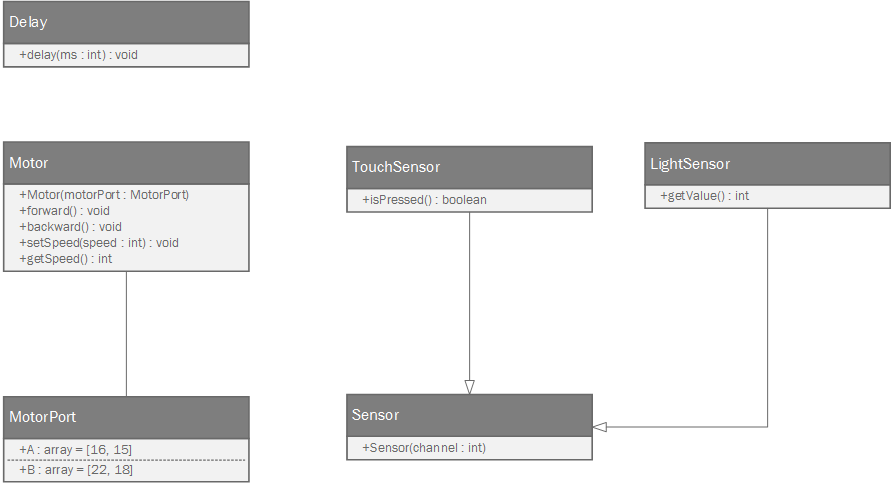

#API

Für die einfache Benutzung des LegoPi-Roboters wurde eine individuelle API entwickelt. Um den Wechsel zwischen der LeJOS Bibliothek, welche direkt auf den Lego Mindstorm-Komponenten läuft, und der für den RaspberryPi entwickelten API so einfach wie möglich zu gestalten, ist diese stark an die LeJOS Software-Architektur angelehnt. 

Entwickelt wurde die API in der Programmiersprache Python und mithilfe der Bibliothek RPi.GPIO, welche eine einfache Verwendung der RaspberryPi GPIO-Pins ermöglicht, sowie SpiDev um den SPI-Bus ansprechen zu können. Mithilfe der entwickelten API ist es möglich bis zu zwei Motoren und acht Sensoren zu steuern. Motoren werden mithilfe eines übergebenen MotorPorts instanziiert. Dieser MotorPort beschreibt, an welchen GPIO Pins der Motor angeschlossen ist. Sensoren gibt es in zwei unterschiedlichen Spezialisierungen, den Tastsensor (TouchSensor), sowie den Lichtsensor (LightSensor). Beide sind eine Erweiterung der Klasse Sensor, welche Grundlegende Aufgaben übernimmt, die für alle Sensoren-Arten benötigt werden. Der Lichtsensor liefert mit seiner einzigen öffentlichen Methode "getValue()" einen numerischen Wert zurück, der die Lichtreflektion beschreibt. Je geringer die Reflektion, desto geringer ist der Rückgabewert. Zu beachten ist hier, dass durch unterschiedliche Lichtverhältnisse bedingt, verschiedene Werte zurückgeliefert werden können. Deshalb ist zu empfehlen, nicht nach einem konkreten Wert zu suchen, sondern ein gewisses Delta zuzulassen.

Eine einfache Beispielanwendung:

    from LegoPi import *
    
	# instanziiere Lichtsensoren für Channel 0 und 1
    lightSensorA = LightSensor(0)
    lightSensorB = LightSensor(1)
	# instanziiere Tastsensor für Channel 2
    touchSensor = TouchSensor(2)

	# instanziiere Motoren A und B
    motorA = Motor(MotorPort.A)
    motorB = Motor(MotorPort.B)

	# setze Geschwindigkeit beider Motoren auf 30
	motorA.setSpeed(30)
	motorB.setSpeed(30)

	# fahre mit beiden Motoren vorwärts
	motorA.forward()
    motorB.forward()
    
	# solange der Tastsensor nicht gedrück ist
    while not touchSensor.isPressed():
		# warte 50 ms
   	 	delay(50)
		# Ist der Wert von LichtsensorA geringer 150
    	if lightSensorA.getValue() <= 150:
			# stoppe MotorA
    		motorA.stop()
		# Ist der Wert größer 80, fahre vorwärts
    	else:
    		motorA.forward()
    
		# Ist der Wert von LichtsensorB geringer 80
		if lightSensorB.getValue() <= 150:
    		motorB.stop()
    	else:
			# Ist der Wert größer 80, fahre vorwärts 
    		motorB.forward()
    
	# Stoppe Motor A und B
    motorA.stop()
    motorB.stop()
    
#Software

Die LegoPi Software besteht aus vier grundlegenden Komponenten die einen einfachen Einstieg in die Benutzung gewährleisten.

##LegoPi.Py - API
In dem Python-Modul LegoPi sind alle in [Abbildung] gezeigten Funktionalitäten eingebaut. Dieses Modul kann vom Entwickler genutzt werden um den individuellen Code für die Steuerung des LegoPi-Roboters 